# Audiojacker Docker Compose Plan

## Overview

This plan outlines the architecture for a comprehensive media downloading and streaming stack using Docker Compose. The setup uses gluetun as a VPN gateway for download services while keeping media servers accessible directly.

## Services Summary

| Service | Purpose | Network | Port |
|---------|---------|---------|------|
| **gluetun** | VPN Gateway (ProtonVPN) | Bridge | None (internal) |
| **qBittorrent** | Torrent client | Via gluetun | 8080 |
| **Lidarr** | Music collection manager | Via gluetun | 8686 |
| **slskd** | Soulseek client | Via gluetun | 5000 |
| **soularr** | Lidarr + Soulseek integration | Via gluetun | 8400 |
| **yubal** | YouTube audio downloader | Via gluetun | 8888 |
| **torbox-auto-downloader** | Torbox integration | Via gluetun | N/A |
| **audiobookshelf** | Audiobook server | Bridge (direct) | 13378 |
| **koel** | Music streaming server | Bridge (direct) | 8000 |

## Network Architecture

```mermaid
flowchart TB
    subgraph Internet[Internet]
        vpn_servers[ProtonVPN Servers]
        trackers[Torrent Trackers]
        soulseek[Soulseek Network]
        torbox_api[Torbox API]
        youtube[YouTube]
    end

    subgraph Docker[Docker Network: media_net]
        subgraph VPN_Routed[VPN-Routed via gluetun]
            gluetun[gluetun VPN Gateway]
            qbittorrent[qBittorrent :8080]
            lidarr[Lidarr :8686]
            slskd[slskd :5000]
            soularr[soularr :8400]
            yubal[yubal :8888]
            torbox[torbox-auto-downloader]
        end

        subgraph Direct_Access[Direct Access]
            audiobookshelf[audiobookshelf :13378]
            koel[koel :8000]
        end
    end

    subgraph Storage[Shared Volumes]
        downloads[downloads - Torrent and Soulseek Downloads]
        audiobooks[audiobooks - Audiobook Library]
        music[music - Music Library]
        config[config - Service Configs]
    end

    gluetun -->|VPN Tunnel| vpn_servers
    qbittorrent -->|via gluetun| trackers
    slskd -->|via gluetun| soulseek
    torbox -->|via gluetun| torbox_api
    yubal -->|via gluetun| youtube

    qbittorrent --> downloads
    slskd --> downloads
    lidarr --> music
    soularr --> music
    yubal --> music
    audiobookshelf --> audiobooks
    koel --> music
```



## Directory Structure

```
/mnt/fast-block/audiojacker/
├── downloads/          # Incomplete and completed downloads
│   ├── torrents/       # qBittorrent downloads
│   ├── soulseek/       # slskd downloads
│   └── complete/       # Completed downloads ready for processing
├── audiobooks/         # Audiobook library (audiobookshelf)
├── music/              # Music library (koel, lidarr)
│   ├── incoming/       # Music being processed
│   └── library/        # Organized music library
└── config/             # Service configuration directories
    ├── gluetun/
    ├── qbittorrent/
    ├── lidarr/
    ├── slskd/
    ├── soularr/
    ├── yubal/
    ├── torbox/
    ├── audiobookshelf/
    └── koel/
```

## Service Configuration Details

### gluetun (VPN Gateway)
- **Image**: qmcgaw/gluetun
- **VPN Provider**: ProtonVPN
- **Required Environment Variables**:
  - `VPN_SERVICE_PROVIDER=protonvpn`
  - `OPENVPN_USER` - ProtonVPN OpenVPN username
  - `OPENVPN_PASSWORD` - ProtonVPN OpenVPN password
  - `SERVER_COUNTRIES` - Preferred server countries
- **Capabilities**: NET_ADMIN for VPN tunneling
- **Ports Exposed**: None directly (services connect through it)

### qBittorrent (Torrent Client)
- **Image**: linuxserver/qbittorrent
- **Network Mode**: service:gluetun (routes through VPN)
- **Web UI Port**: 8080
- **Key Paths**:
  - `/downloads` - Download location
  - `/config` - Configuration persistence
- **Environment**: PUID, PGID, TZ

### Lidarr (Music Collection Manager)
- **Image**: linuxserver/lidarr
- **Network Mode**: service:gluetun (routes through VPN)
- **Web UI Port**: 8686
- **Key Paths**:
  - `/config` - Configuration
  - `/music` - Music library
  - `/downloads` - Download monitoring

### slskd (Soulseek Client)
- **Image**: slskd/slskd
- **Network Mode**: service:gluetun (routes through VPN)
- **Web UI Port**: 5000
- **Soulseek Ports**: 22398-22400 (for P2P connections)
- **Required**: Soulseek account credentials

### soularr (Lidarr + Soulseek Integration)
- **Image**: guillevc/yubal (Note: Need to verify correct image)
- **Network Mode**: service:gluetun (routes through VPN)
- **Port**: 8400
- **Purpose**: Bridges Lidarr with Soulseek for automated music downloading
- **Requires**: Connection to both Lidarr and slskd

### yubal (YouTube Audio Downloader)
- **Image**: guillevc/yubal
- **Network Mode**: service:gluetun (routes through VPN)
- **Port**: 8888
- **Purpose**: Download audio from YouTube

### torbox-auto-downloader
- **Image**: mrjoiny/torbox-auto-downloader
- **Network Mode**: service:gluetun (routes through VPN)
- **Requires**: Torbox API key
- **Purpose**: Automated downloading from Torbox service

### audiobookshelf (Audiobook Server)
- **Image**: advplyr/audiobookshelf
- **Network Mode**: Bridge (direct access)
- **Port**: 13378
- **Key Paths**:
  - `/audiobooks` - Audiobook library
  - `/config` - Configuration
  - `/metadata` - Metadata database

### koel (Music Streaming)
- **Image**: koel/koel
- **Network Mode**: Bridge (direct access)
- **Port**: 8000
- **Database**: SQLite (simplified setup)
- **Key Paths**:
  - `/music` - Music library
  - `/data` - SQLite database

## Environment Variables Required

| Variable | Description | Service |
|----------|-------------|---------|
| `PUID` | User ID for file permissions | All linuxserver containers |
| `PGID` | Group ID for file permissions | All linuxserver containers |
| `TZ` | Timezone | All containers |
| `PROTONVPN_USER` | ProtonVPN OpenVPN username | gluetun |
| `PROTONVPN_PASSWORD` | ProtonVPN OpenVPN password | gluetun |
| `PROTONVPN_SERVERS` | Preferred server countries | gluetun |
| `QBITTORRENT_USER` | qBittorrent web UI username | qbittorrent |
| `QBITTORRENT_PASS` | qBittorrent web UI password | qbittorrent |
| `SOULSEEK_USER` | Soulseek username | slskd |
| `SOULSEEK_PASS` | Soulseek password | slskd |
| `LIDARR_API_KEY` | Lidarr API key | soularr |
| `TORBOX_API_KEY` | Torbox API key | torbox-auto-downloader |
| `KOEL_ADMIN_EMAIL` | Koel admin email | koel |
| `KOEL_ADMIN_PASS` | Koel admin password | koel |

## Files to Create

1. **docker-compose.yaml** - Main compose file with all services
2. **.env** - Environment variables (with placeholder values)
3. **README.md** - Setup and usage documentation